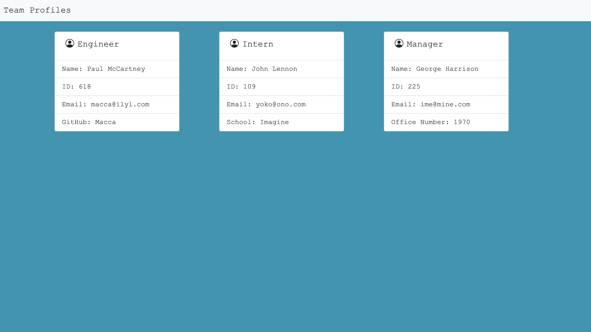
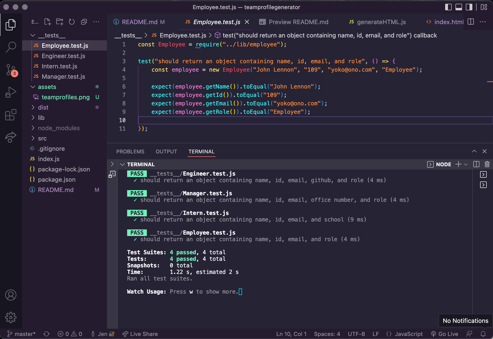

# Team Profile Generator

## Table of Contents
1. [Description](#description)
2. [Installation](#installation)
3. [Usage](#usage)
4. [License](#license)
5. [Contributing](#contributing)
6. [Test](#test)
7. [Questions](#questions)

## Description
This is a Node.js command-line application that takes in information about employees on a software engineering team and generates an HTML webpage. Tests are included for each employee role. 

```md
GIVEN a command-line application that accepts user input
WHEN I am prompted for my team members and their information
THEN an HTML file is generated that displays a nicely formatted team roster based on user input
WHEN I click on an email address in the HTML
THEN my default email program opens and populates the TO field of the email with the address
WHEN I click on the GitHub username
THEN that GitHub profile opens in a new tab
WHEN I start the application
THEN I am prompted to enter the team manager’s name, employee ID, email address, and office number
WHEN I enter the team manager’s name, employee ID, email address, and office number
THEN I am presented with a menu with the option to add an engineer or an intern or to finish building my team
WHEN I select the engineer option
THEN I am prompted to enter the engineer’s name, ID, email, and GitHub username, and I am taken back to the menu
WHEN I select the intern option
THEN I am prompted to enter the intern’s name, ID, email, and school, and I am taken back to the menu
WHEN I decide to finish building my team
THEN I exit the application, and the HTML is generated
```

## Usage
The following image shows a mock-up of the generated HTML’s appearance and functionality:




[Full Jest demo](https://drive.google.com/file/d/1QWGLudIcAO5oiyV0_GbVFwP57KjBir3Z/view)

[Full Inquirer demo](https://drive.google.com/file/d/1THvQlJcMe8qAG_oX7fCYD4BLT1ebKHa-/view)


## Installation
This application will require the Inquirer module and can be invoked by typing `node index.js`

## Contributing
Jen Cho

## Test
This application requires the Jest module. To run test, type `npm run test`

## Questions
Email me with any questions at yoonme@gmail.com.

Find me on Github: [choyoonme](http://www.github.com/choyoonme)
